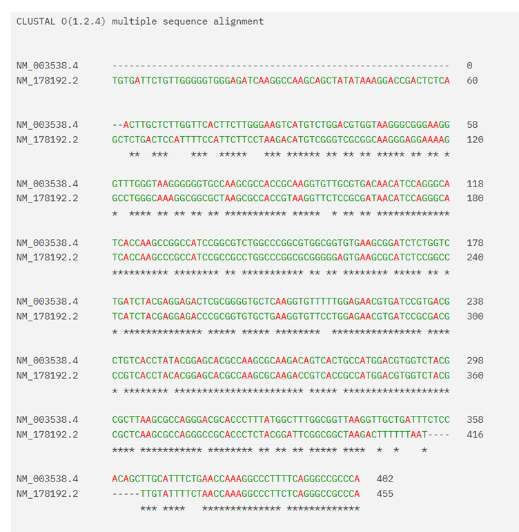
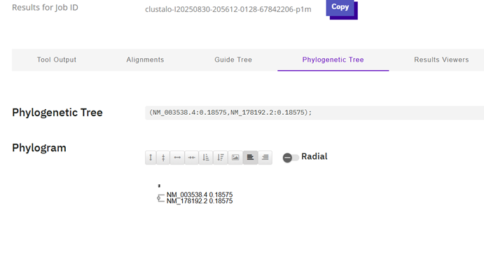
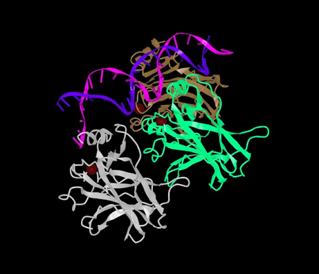
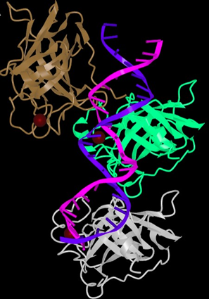
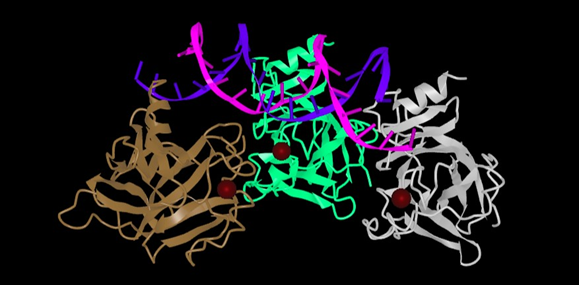
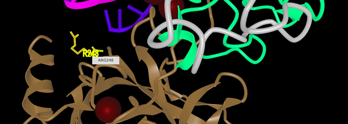

# Undergraduate Research Portfolio
**Areesha Tahreem**
BS Biotechnology | International Islamic University Islamabad
**CGPA:3.96**

## Project 1: Comparative Gene Analysis 
**Gene**: HIST1H4A
**Specie**: Homo Sapiens & Mus Musculus
**Databases**: NCBI & ClustalOmega

I chose this gene for the project because of its high conservation.
I retrieved the FASTA sequences for both species from the NCBI database and performed multiple sequence alignment using ClustalOmega.

**Multiple Sequence Alignment:**

**Phylogenetic Tree:**

The value 0.18575 represents a high level of conservation between two sequences.

---

## Project 2: Protein Structure Analysis
**Protein**: P53 Tumor Suppressor
**Databases and Tools**: RCSB Protein Data Bank & iCn3D

I retrieved the 3D structure of protein p53 from RCSB and visualized it using the molecular visualization tool iCn3D.

**Whole Structure:**

**Side view of p53:**

**Binding sites:**

**Arg248 Residue:**

The purpose of studying the structure was its importance in drug design for targeted therapies like Arg248 mutations in cancer.

---

## Project 3: Mini Literature Review
**Title:** Stem Cell Aging as a Metabolic Dysregulation: Disruption to Rejuvenation
**Course:** Cellular Metabolism | Semester 5th | October'2025

I collaborated in this literature review with my 2 teammates, focusing on stem cell aging.
My primary contribution was on Sections on NAD+ decline, ROS accumulation, AMPK-mTOR pathway, and 
therapeutic strategies.  

---

## Current Work:
Collaborating with 2 classmates on a research proposal as coursework for Research Methodology.

*Built this portfolio independently for International Research Opportunities*
